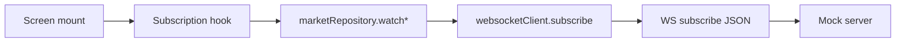
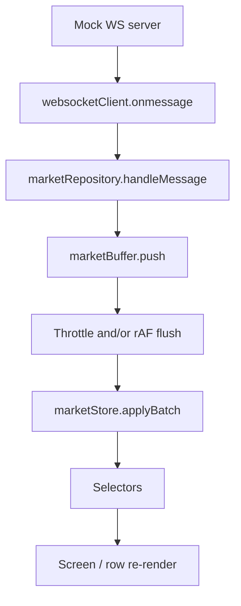
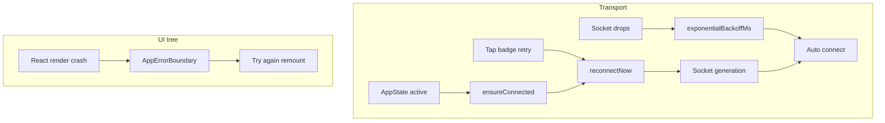

# Architecture — data flow

How market data moves through the app. Screens never open a WebSocket; they subscribe via hooks and read Zustand.

## Layers (top → bottom)

```text
Screens / components     UI only — select state, call hooks
        ↓
Hooks                    useTickerSubscriptions / useProductDetailSubscriptions
        ↓
marketRepository         App-facing API (watch*, reconnect, ensureConnected)
        ↓
┌───────────────────────┬────────────────────────┐
│ websocketClient       │ marketBuffer           │
│ connect / subscribe   │ hold fast WS messages  │
│ reconnect / status    │ flush later to store   │
└───────────────────────┴────────────────────────┘
        ↓                          ↓
   Mock WS server            marketStore (Zustand)
   (:8080)                   → selectors → UI
```

| Layer | Owns | Does not own |
| --- | --- | --- |
| Screens | Layout, user actions | Sockets, raw messages |
| Hooks | Subscribe/unsubscribe lifecycle | Parsing, buffering |
| `marketRepository` | Wiring transport ↔ buffer ↔ store, AppState | UI |
| `websocketClient` | Wire protocol, ref-counts, reconnect | Zustand writes |
| `marketBuffer` | When to apply updates | Opening sockets |
| `marketStore` | Tickers / books / trades / status | Network |

---

## 1. Subscribe path (UI → server)

User opens a screen → hook mounts → repository watches channels → transport sends `subscribe` (deltas only).



| Screen | Channels |
| --- | --- |
| Markets / Favorites | `v2/ticker` only |
| Product detail | `v2/ticker` + `l2_orderbook` + `all_trades` |

**Ref-count:** same `channel + symbol` shared across screens (e.g. Markets + Detail both hold ticker). Wire `SUBSCRIBE` only when count goes `0 → 1`. Wire `UNSUBSCRIBE` only after grace when count stays `0`.

**Leave screen:** hook cleanup → unsubscribe (grace 100ms for Strict Mode remounts).

---

## 2. Live data path (server → UI)

Socket messages do **not** write React state immediately. Buffer sits in the middle on purpose.



### Simple picture

```text
Socket tick (fast)     →  Buffer (mailbox)  →  Store (state)  →  UI
10–50ms tickers           keep latest            applyBatch       re-render
                          flush on policy
```

### Buffer policy (channel-aware)

| Channel | When | How | Why |
| --- | --- | --- | --- |
| `v2/ticker` | Throttle ~300ms; latest wins | Then `requestAnimationFrame` | Calm markets list |
| `l2_orderbook` / `all_trades` | Latest within a frame | `requestAnimationFrame` | Detail feels live |

Store also skips ticker writes when UI-visible fields are unchanged.

---

## 3. Connection / errors

Two failure domains — don’t mix them in your head:



- **Transport:** status in store → badge/footer; tap skips backoff; generation stops ghost `onclose` reconnects.
- **UI tree:** `AppErrorBoundary` — not used for WS drops.

---

## 4. Example: Markets → ETH detail

```text
1. Markets mounted
   wire: subscribe v2/ticker [BTC, ETH, XRP, SOL, PAXG, DOGE]

2. Open ETH detail (Markets still under the stack)
   ticker ETH ref-count 1 → 2  (no new ticker subscribe)
   wire: subscribe l2_orderbook [ETH], all_trades [ETH]

3. Server log "Client subscriptions: [...]"
   = full aggregate state for this client
   ≠ "app resent all tickers again"

4. Prices / book / trades
   WS → buffer → store → ETH row / detail panels update
```

---

## 5. Key files

| File | Role in the flow |
| --- | --- |
| `src/hooks/useProductSubscriptions.ts` | Screen lifecycle ↔ watch* |
| `src/api/marketRepository.ts` | Single entry; wires message → buffer → store |
| `src/api/websocketClient.ts` | One socket; ref-count; reconnect; generation |
| `src/api/marketBuffer.ts` | Separates socket rate from state rate |
| `src/stores/marketStore.ts` | `applyBatch` / `setStatus` |
| `src/selectors/marketSelectors.ts` | Narrow reads so one symbol doesn’t redraw the list |
| `src/commonUtils/backoff.ts` | Reusable reconnect delay |

Setup and product notes: [README.md](./README.md). Mock protocol: [server/README.md](./server/README.md).  

Interview deep-dives (why / tradeoffs / alternatives): [INTERVIEW_ARCHITECTURE_QA.md](./INTERVIEW_ARCHITECTURE_QA.md).
